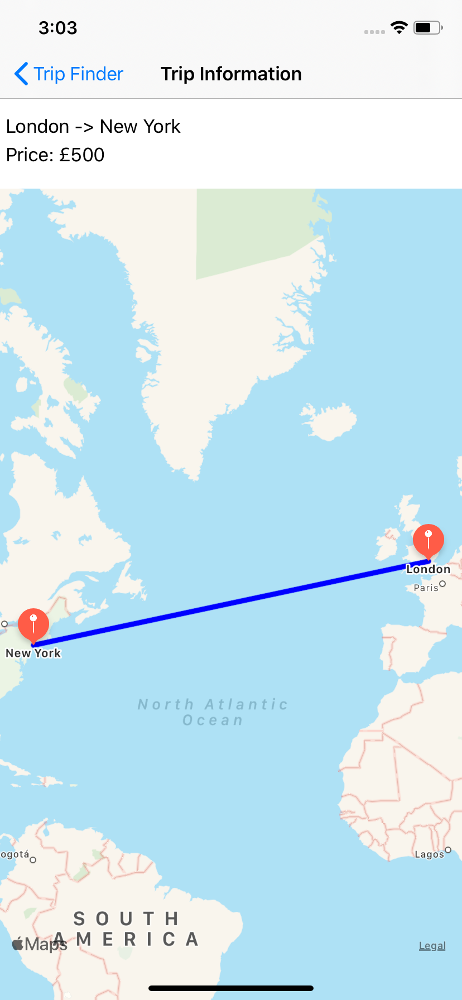

# DijkstraTripPlanner

This is a small app demonstrating the use of Dijkstra algorithm (https://en.wikipedia.org/wiki/Dijkstra%27s_algorithm) for finding the shortest paths between nodes in a graph. In this example, users enter a starting location and end destination and the algorithm will be used to find the cheapest route which will then be plotted on a MapView.

MapViewController|TripViewController
---|---
|

## Frameworks Used

No 3rd party frameworks were used in this app

## Requirements

This use Swift Combine so requires iOS 13 to run
